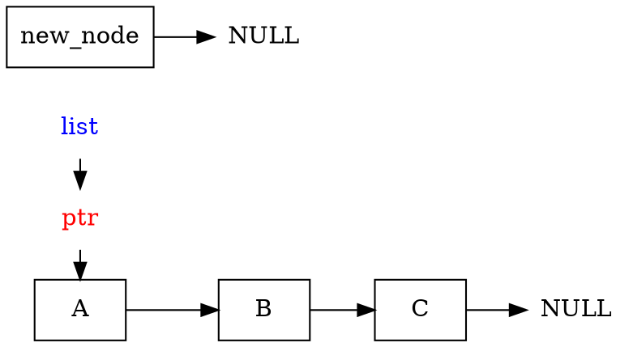
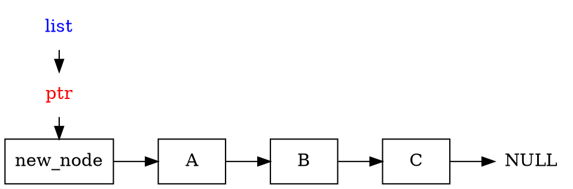
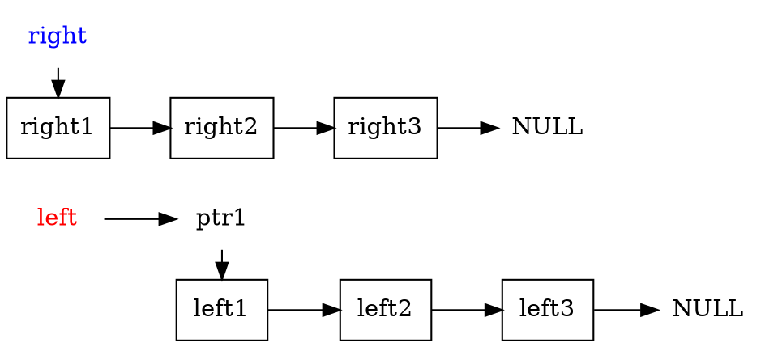
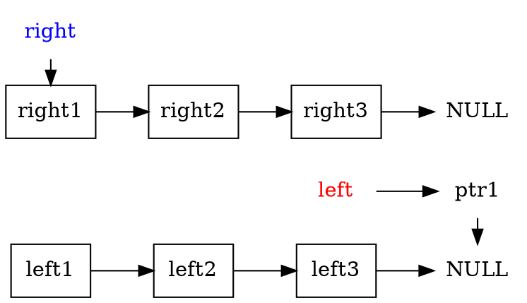
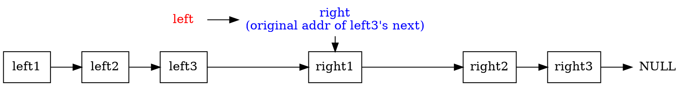
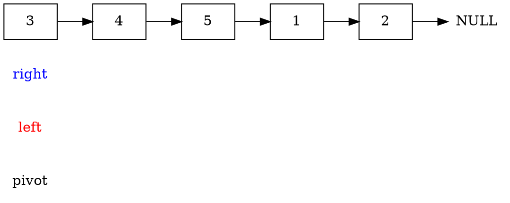
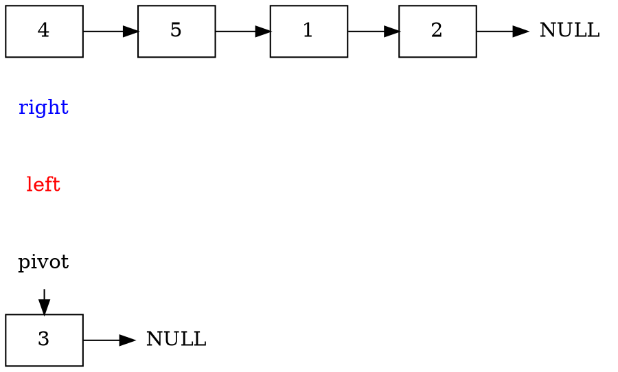
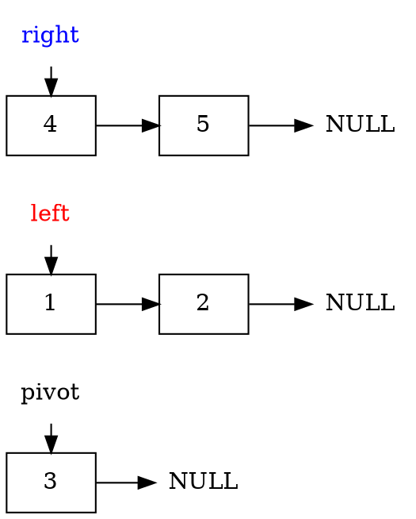
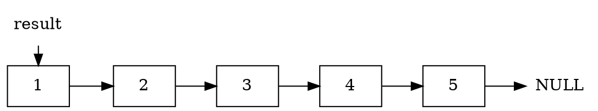

# 2021q1 Homework1 (quiz1)
contributed by < `qwe661234` >
###### tags: `linux2021`
## 程式運作原理

### `node_t` structure
```cpp
typedef struct __node {                   
    int value;
    struct __node *next;
} node_t;
```

### list_add_node_t
```cpp
static inline void list_add_node_t(node_t **list, node_t *node_t) {
    node_t->next = *list;
    *list = node_t;
}
```




### list_concat
在 while loop 中找到 list left 的尾端，並將另一個 list right 接在 list left 尾端
``` cpp
static inline void list_concat(node_t **left, node_t *right) {
    while (*left)
        left = &((*left)->next);
    *left = right;
}
```



```cpp
while (*left)
        left = &((*left)->next);
```



```cpp
*left = right;
```



### quicksort
```cpp
void quicksort(node_t **list)
{
    if (!*list)
        return;

    node_t *pivot = *list;
    int value = pivot->value;
    node_t *p = pivot->next;
    pivot->next = NULL;

    node_t *left = NULL, *right = NULL;
    while (p) {
        node_t *n = p;
        p = p->next;
        list_add_node_t(n->value > value ? &right : &left, n);
    }

    quicksort(&left);
    quicksort(&right);

    node_t *result = NULL;
    list_concat(&result, left);
    list_concat(&result, pivot); 
    list_concat(&result, right);
    *list = result;
}
```
選定 list_head 作為 pivot，將 value 比 pivot 大的值接在 list right，將 value 比 pivot 小的值接在 list left，再分別對 list left 和 list right 繼續遞迴做 quicksort，當分出來的 list left 和 list right 都 return 後，依序將 list left, pivot, right 接上



選定 list_head 作為 pivot


將 value 比 pivot 大的值接在 list right，將 value 比 pivot 小的值接在 list left


對 list left 和 list right 繼續遞迴做 quicksort，最後會得到排序好的 list left 和 list right 


依序將 list left, pivot, right 接上


## 延伸問題
### 1.測試程式使用到 random，多執行幾次可發現輸出結果相仿，請修正，並引入其他 Pseudorandom number generator

### 修正多執行幾次輸出結果相仿: 引入亂數種
>所謂亂數種子可以視為是產生亂數的一種規律，如果不加以事先設定，則每次執行程式時產生的亂數規律都會一模一樣；為了避免亂數產生順序被使用者完全掌控，因此我們常藉助系統時間的變動性來作為亂數種子，這樣每次執行程式時會因為時間不同，其產生的亂數規律與結果也不一樣
```cpp
srandom(time(0));
    node_t *list = NULL;
    while (count--) {
        list = list_make_node_t(list, random() % 1024);
    }
```

### 引入其他 Pseudorandom number generator
這次使用的是 **Lagged Fibonacci generator**

**Fibonacci 數列:**
$Sn = Sn-1 + Sn-2$
而**Lagged Fibonacci generator** 則是以 $Sn≡Sn−j⋆Sn−k(modm),0<j<k$ 來生成亂數，其中的　$Sn$、$Sn-j$、$Sn-k$，皆為 Fibonacci 數列中的值，而 operator$⋆$ 則可以是 addition ($+$), subtraction ($−$), multiplication ($×$) or XOR (^). 
此做法可大大增加亂數週期，使使用者更難猜測其規律。

:::danger
用合法的 LaTeX 語法來表達上述符號和數學式
:notes: jserv
:::

###  generator 實作
```cpp
int f[100], op, j, k, out;
f[0] = 1;
f[1] = 1;
for(int i = 2; i < 100; i++){
    f[i] = f[i - 1] + f[i - 2];
}

size_t count = 20;
srandom(time(0));
node_t *list = NULL;
while (count--) {
    op = random() % 4;
    j = random() % 100;
    k = random() % 100;
    while(!(j < k)){
        j = random() % 100;
        k = random() % 100;
    }
    switch(op){
        case 0:
            out = f[99 - j] + f[99 -k];
            break;
        case 1:
            out = f[99 - j] - f[99 -k];
            break;
        case 2:
            out = f[99 - j] * f[99 -k];
            break;
        case 3:
            out = f[99 - j]^f[99 -k];
            break;
    }
    list = list_make_node_t(list, out % 1024);
}
```
### ２.參考 Optimized QuickSort — C Implementation (Non-Recursive) 並重寫上述 quick sort 程式碼，避免使用遞迴呼叫
### nonrecursive quicksort 程式碼
```c =
void quicksort_nonrecursive(node_t **list, int size)
{
    if (!*list)
        return;

    int beg[MAX_LEVELS], end[MAX_LEVELS], i=0, L, R, piv_pos;
    node_t *piv, *temp;
    beg[0] = 0; 
    end[0] = size;
    while (i >= 0) {
        L = beg[i]; 
        R = end[i]-1;
        if (L <  R) {
            piv = find_ele(*list, L); 
            if (i == MAX_LEVELS-1) 
                return;
            while (L < R) {
                while (find_ele(*list, R)->value >= piv->value && L < R) {
                    R--;
                }   
                if (L < R) {
                    move_node(list, R, L);
                    L++;
                }
                while (find_ele(*list, L)->value <= piv->value && L < R) {
                    L++;
                }
                if (L < R) {
                    move_node(list, L, R); 
                    R--;
                }
            }
                if (find_ele(*list, L)->value > piv->value) {
                    R--;
                    L--;
                }
            move_node(list, find_ele_byVal(*list, piv->value), L);
            beg[i + 1] = L + 1; 
            end[i + 1] = end[i]; 
            end[i++] = L; 
        } else {
            i--; 
        }
    }
}
```

輔助用途函式的實作
```cpp
static inline node_t *find_ele(node_t *head, int pos){
    node_t *ptr = head;
    for(int i = 0; i < pos; i++){
        ptr = ptr->next;
    }
    return ptr;
}

static inline int find_ele_byVal(node_t *head, int target){
    node_t *ptr = head;
    int pos = 0;
    while (ptr->value != target) {
        pos ++;
        ptr = ptr->next;
    }
    return pos;
}

static inline void move_node(node_t **list, int pos, int des){
    if(pos == des){
        return;
    }
    node_t *ptr = *list;
    for(int i = 0; i < pos; i++){
        ptr = ptr->next;
    }
    node_t *temp = ptr;
    if (ptr == *list) {
        *list = (*list)->next;
    } else {
        ptr = *list;
        for(int i = 0; i < pos - 1; i++){
            ptr = ptr->next;
        }
        ptr->next = temp->next;
        temp->next = NULL;
    }
    if (des == 0) {
        temp->next = *list;
        *list = temp;
    } else {
        ptr = *list;
        for(int i = 0; i < des - 1; i++){
            ptr = ptr->next;
        }
        temp->next = ptr->next;
        ptr->next = temp;
    }
}
```

:::danger
上述程式碼較為冗長，請思索更精簡的實作
:notes: jserv
:::


